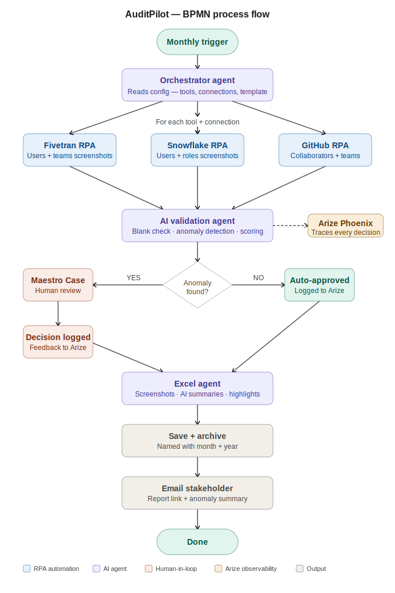

# 🛡️ AuditPilot
### Agentic Compliance Documentation Across Your Data Stack

> **UiPath AgentHack 2026 — Track 2: UiPath Maestro BPMN**

[](https://www.uipath.com/)
[](https://uipath-agenthack.devpost.com/)
[](https://www.anthropic.com/)
[](LICENSE)

---

## 📌 The Problem

Every month, compliance teams manually log into multiple SaaS tools (Fivetran, Snowflake, GitHub), navigate to each connection, take screenshots of users and teams, and paste them into an Excel control document. With 5+ connections per tool, this process:

- Takes **3–4 hours** per month per team
- Is **error-prone** — wrong screenshots, missed connections, broken formatting
- Offers **zero intelligence** — no anomaly detection, no audit trail
- **Scales poorly** — more connections = more manual effort

---

## ✅ The Solution

**AuditPilot** is a fully agentic compliance documentation system built on the UiPath Platform. It:

1. **Automatically navigates** Fivetran, Snowflake, and GitHub via RPA
2. **Captures screenshots** of users and teams for every connection
3. **Validates each screenshot** with an AI agent (blank check, anomaly detection)
4. **Escalates anomalies** to a human reviewer via UiPath Maestro Case
5. **Generates a structured Excel control document** with AI-written summaries
6. **Notifies stakeholders** and archives the report automatically

What used to take hours now runs in **minutes — fully automated, every month.**

---

## 🏗️ Architecture

```
[Monthly Scheduler / On-Demand Trigger]
              ↓
    [Orchestrator Agent]
    reads config: tools, connections, template
              ↓
┌─────────────────────────────────────┐
│  For each tool (Fivetran, Snowflake,│
│  GitHub) + each connection:         │
│  • RPA navigates UI                 │
│  • Captures Users screenshot        │
│  • Captures Teams screenshot        │
└─────────────────────────────────────┘
              ↓
    [AI Validation Agent]
    • Blank/loading check → retry
    • Anomaly detection (user spikes,
      missing teams, unauthorized access)
    • Confidence scoring per screenshot
              ↓
       Anomaly found?
      /             \
    YES              NO
     ↓               ↓
[Maestro Case]   [Auto-approve]
 Human review
 Approve/Reject
      ↓
[Excel Agent]
 • Pastes screenshots per section
 • AI-written summary per connection
 • Highlights anomalies in red
 • Stamps date, reviewer, status
      ↓
[Save + Archive + Email Notification]
```

---

## 🧩 UiPath Components Used

| Component | Role in AuditPilot |
|---|---|
| **UiPath Maestro BPMN** | Orchestrates the full end-to-end flow |
| **UiPath Maestro Case** | Manages anomaly escalation to human reviewers |
| **UiPath Agent Builder** | AI Validation Agent for screenshot analysis |
| **UiPath RPA / Studio** | Browser automation — navigate SaaS UIs, capture screenshots |
| **UiPath Excel Activities** | Build and format the control document |
| **UiPath API Workflows** | Email notifications, archive storage |
| **UiPath Scheduler** | Monthly trigger |
| **Claude Code** | Used to build and scaffold UiPath workflow components |

---

## 🔗 External Integrations

| Tool | Purpose |
|---|---|
| **Fivetran** (Web UI) | Data pipeline access control screenshots |
| **Snowflake** (Web UI) | Data warehouse user/role screenshots |
| **GitHub** (Web UI) | Repository access control screenshots |
| **Microsoft Excel** | Control document output |
| **Email (SMTP/API)** | Stakeholder notification |

---

## 💰 Prize Tracks Targeted

- 🥇 Grand Prize
- 🏆 Best of UiPath Maestro BPMN
- 🌐 Best Cross-Platform Integration
- 🎯 Best Demo / Presentation
- 💡 Best Product Feedback
- ⭐ Coding Agents Bonus Points (Claude Code)

---

## 📁 Project Structure

```
auditpilot/
├── README.md
├── LICENSE
├── config/
│   ├── connections.json          # List of SaaS tools and connections
│   └── template_mapping.json     # Excel section mapping per connection
├── src/
│   ├── rpa/
│   │   ├── fivetran_navigator.xaml    # RPA workflow: Fivetran UI navigation
│   │   ├── snowflake_navigator.xaml   # RPA workflow: Snowflake UI navigation
│   │   └── github_navigator.xaml      # RPA workflow: GitHub UI navigation
│   ├── agents/
│   │   ├── validation_agent.py        # AI screenshot validation agent
│   │   └── excel_agent.py             # Excel document generation agent
│   ├── bpmn/
│   │   └── auditpilot_flow.bpmn       # Main BPMN process definition
│   ├── excel/
│   │   ├── control_document_template.xlsx
│   │   └── excel_builder.xaml         # Excel population workflow
│   └── notifications/
│       └── email_notifier.xaml        # Stakeholder email workflow
├── docs/
│   ├── architecture.png               # Architecture diagram
│   ├── bpmn_flow.png                  # BPMN flow diagram
│   └── demo_screenshots/              # Demo screenshots
├── tests/
│   └── validation_agent_tests.py      # Unit tests for validation agent
└── assets/
    └── presentation_deck.pdf          # Hackathon presentation
```

---

## 🚀 Getting Started

### Prerequisites

- UiPath Automation Cloud account (UiPath Labs via AgentHack)
- UiPath Studio Web access
- Claude Code CLI (for coding agent bonus)
- Access to Fivetran, Snowflake, and GitHub (or demo credentials)

### Setup Instructions

1. **Clone the repository**
   ```bash
   git clone https://github.com/YOUR_USERNAME/auditpilot.git
   cd auditpilot
   ```

2. **Configure your connections**
   ```bash
   cp config/connections.sample.json config/connections.json
   # Edit connections.json with your tool credentials and connection names
   ```

3. **Import BPMN flow into UiPath Maestro**
   - Open UiPath Automation Cloud
   - Navigate to Maestro → Import Process
   - Upload `src/bpmn/auditpilot_flow.bpmn`

4. **Deploy RPA workflows**
   - Open UiPath Studio Web
   - Import workflows from `src/rpa/`
   - Publish to your Automation Cloud tenant

5. **Configure the Validation Agent**
   - Open Agent Builder in UiPath Automation Cloud
   - Import agent definition from `src/agents/validation_agent.py`
   - Set your LLM connection (Claude / OpenAI)

6. **Set up the monthly trigger**
   - In UiPath Orchestrator, create a Time Trigger
   - Point it to the Maestro BPMN process
   - Set recurrence to monthly

7. **Run your first audit**
   - Trigger manually from Orchestrator
   - Monitor in Maestro dashboard
   - Check output Excel in the configured archive folder

---

## 🤖 Coding Agents Usage

This project was built using **Claude Code** via UiPath for Coding Agents:

- Scaffolded the BPMN process structure
- Generated the AI Validation Agent logic
- Built the Excel document population workflow
- Created the anomaly detection scoring model

To use Claude Code with UiPath CLI:
```bash
npm install -g @uipath/cli
uipath auth login
# Then use Claude Code to interact with your UiPath workflows
```

---

## 📊 Business Impact

| Metric | Before AuditPilot | After AuditPilot |
|---|---|---|
| Time per monthly audit | 3–4 hours | ~10 minutes |
| Human errors | Common | Near zero |
| Anomaly detection | Manual / none | Automated + alerted |
| Scalability | Degrades with more connections | Scales linearly |
| Audit trail | None | Full log per run |

---

## 👥 Team

**Team AuditPilot** — UiPath AgentHack 2026

---

## 📄 License

This project is licensed under the MIT License. See [LICENSE](LICENSE) for details.

---

## 🙏 Acknowledgements

- [UiPath](https://www.uipath.com/) for the platform and AgentHack opportunity
- [Anthropic](https://www.anthropic.com/) for Claude Code
- [UiPath Community](https://community.uipath.com/) for resources and inspiration
